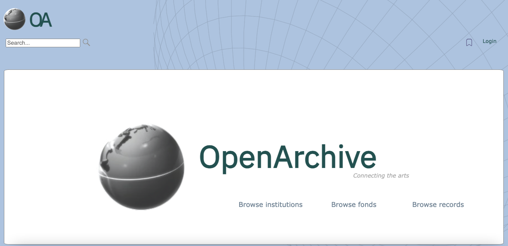

# OpenArchive

OpenArchive is a collections management system designed to :

1. meet the digital preservation and curatorial needs of GLAM institutions (i.e. galleries, archives, libraries, and museums), and

2. provide digital access to these collections to the public in an effort to increase accessibility and interest in cultural heritage.

In this way, the App has 2 sets of functionalities intended for 2 distinct clients: cultural institutions and general users. 

---

## The App 

OpenArchive is a MERN stack application. The frontend was built using React, and the backend server was built using MongoDB, Node.js, and Express. In addition to this, the Cloudinary API was used to handle the management of image files.  

---

## Setup

### The Frontend

Use `cd client` and `yarn start` to start the client environment.

### The Backend

Use `cd server` and `yarn start` to start the backend environment.

---

## General Functionality

### Institutions (Logged In)

- Institutions can log in with their credentials. 
- Institutions can perform a full-text search of all their records
- Institutions can browse through their fonds and records.
- Institutions can browse through records housed in specific fonds (related records).
- Institutions can add fonds to their institutional repository.
- Institutions can delete fonds from their institutional repository.
- Institutions can add records to their institutional repository (and respective fonds).
- Institutions can delete records from their institutional repository (and respective fonds).

### Guests

- Users can browse through all registered institutions, fonds, and records.
- Users can perform a full-text search of all records.
- Users can browse through records housed in specific fonds (related records). 
- Users can browse through records and collections housed at specific institutions. 
- Users can bookmark records and collections.
- Users can delete records and collections from their bookmarked items.

---

## Frontend Web Pages 

- `http://localhost:3000/` :  users are introduced to the Homepage where they can browse through institutions, fonds, or records, perform a full-text search, or log in with their institutional credentials
- `/login` : the login page 

### Guest Web Pages

- `/institutions` : the page that lists all the institutions registered in OpenArchive 
- `/institutions/:institutionName` : a given institution's home page  
- `/fonds` : a page that lists all the fonds registered in OpenArchive 
- `/fonds/:fondsName` : a given fonds' page with detailed information about its contents 
- `/related-records/:fondsId` : a page that lists a given fonds' records 
- `/related-records/:fondsId/:recordId` : the record page of a specific given in a given fonds
- `/records` : a page that lists all the records registered in OpenArchive 
- `/records/:recordId` : a given record's page with detailed information about the record
- `/search-results/:query` : a query's search results 
- `/saved-items` : a user's bookmarked items 

### Signed In Web Pages 

- `/:institutionName` : the logged in institution's homepage 
- `/:institutionName/upload-fonds` : a form page that allows an institution to add a new fonds to its repository
- `/:institutionName/upload-record` : a form page that allows an institution to add a new record to a collection in its repository 
- `/:institutionName/search-results/:query` : search results to an institution's query
- `/:institutionName/fonds` : a list of the logged in institution's fonds
- `/:institutionName/fonds/:fondsName` : a given fonds' page 
- `/:institutionName/records` : a list of the logged in institution's records
- `/:institutionName/records/:recordId`: a given record's page

---

## Backend Development

The data (fonds.json, institutions.json, records.json) were batchImported into MongoDB. server.js contains the necessary endpoints, and their respective handlers can be found in the handlers folder. 

